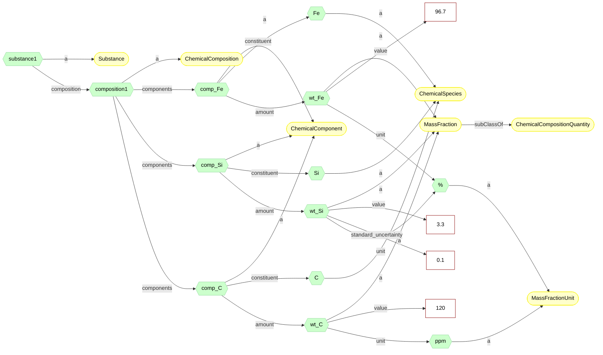

---
hide:
  - toc
---

# ChemicalComposition

The species a substance is made of and how much of each. This is the as-analysed claim: an
elemental analysis names species, not ingredients.

{{ oold_schema_meta_data("materials", "ChemicalComposition") }}

{{ oold_schema_renderer("materials", "ChemicalComposition") }}

EMMO fits this case exactly. A composition there is a language construct, and
`SingleComponentComposition` is the smallest sub-expression that still says something: one
species, one fraction. `components` is EMMO's `hasSpatialTile`, `constituent` its `hasSpeciesPart`,
whose range `ChemicalSpecies` is `ChemicalElement or ChemicalNomenclature or ChemicalFormula`,
so `Fe` and `SiC` both fit.

PMDco reads the same document through its own pattern, where the component is a mass ratio and
the amount the fraction value specification it is specified by.




