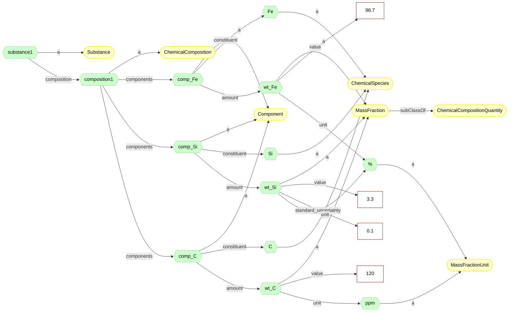

---
hide:
  - toc
---

# Composition

Chemical composition of a substance.

{{ oold_schema_meta_data("materials", "Composition") }}

{{ oold_schema_renderer("materials", "Composition") }}


The example below shows how the chemical composition can be specified for a substance instance:

```json
{
  "$schema": "Composition.schema.json",
  "@context": "Composition.schema.json",
  "@id": "https://example.org/material/no27_14",
  "type": ["Substance"],
  "composition": {
    "type": ["ChemicalComposition"],
    "components": [
      {"type": ["Component"], "constituent": "Fe", "amount": {"type": ["MassFraction"], "value": 96.7, "unit": "PERCENT"}},
      {"type": ["Component"], "constituent": "Si", "amount": {"type": ["MassFraction"], "value": 3.3, "unit": "PERCENT", "standard_uncertainty": 0.1}},
      {"type": ["Component"], "constituent": "C", "amount": {"type": ["MassFraction"], "value": 120, "unit": "PPM"}}
    ]
  }
}
```

It should result generic RDF representation:




